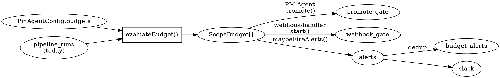

# Design: Spend caps & alerts (Enterprise feature 4.3)

**Date**: 2026-04-14
**Status**: Draft for review
**Scope**: First engineering feature of Phase 1 of the enterprise tier rollout. Extends the existing single-global `dailyTokenBudget` in `pm/budget.ts` with per-team and per-repo caps, Slack alerts at 50%/80%/100% of budget, and a hard cap that refuses new pipeline runs at 100%.

**Parent spec**: `docs/superpowers/specs/2026-04-13-enterprise-tier-design.md` § 4.3.

---

## 1. Goals and non-goals

### Goals
- Give Enterprise customers per-Linear-team and per-repo daily token budgets on top of the existing global `dailyTokenBudget`.
- Fire Slack alerts to the PM Agent's configured channel when any scope crosses 50%, 80%, or 100% of its budget.
- Block new pipeline runs (from both the PM Agent's promote action and direct Linear webhooks) when any relevant scope is at 100%.
- Leave in-flight runs untouched when the cap is crossed — operators resume by raising the cap or waiting for the midnight-UTC reset.
- Preserve the existing single-global behavior unchanged for installs that don't opt into per-team/per-repo scoping.

### Non-goals
- Token-to-dollar conversion or currency display — lands in feature 4.5 (cost & ROI dashboard).
- Per-team Slack channel routing — YAGNI; single channel with optional override is sufficient for v1.
- Live config reload — budgets live in `PmAgentConfig`, edited in code, restart to apply (matches all other urateam config).
- Rolling 24-hour or monthly budget windows — daily UTC matches existing semantics.
- Aborting in-flight runs when the cap is crossed — refuse-new only. Consumer responsibility to drain the queue or resume.
- Dashboard UI for editing budgets — Phase 2 dashboard work.

## 2. Current state

`pm/budget.ts` today:
- Runs once per PM Agent tick (default 30 min)
- Queries today's `totalInputTokens + totalOutputTokens` from `pipeline_runs`, summed globally
- Blocks promotion via `promoteBlocked: true` when the global spend is ≥ 80% of `PmAgentConfig.dailyTokenBudget`
- Does not emit any alerts

Gaps that this feature closes:
- No per-team or per-repo scoping — `pipeline_runs` has `repo_url` but no `linear_team_id` column
- No alerts at any threshold — operators discover the gate only when promotion goes silent
- No enforcement at the direct-webhook path (`webhook/handler.ts`) — a human moving an issue to Todo bypasses the PM Agent's gate entirely

## 3. Architecture overview

Single evaluation function in `pm/budget.ts` produces a multi-scope view of today's spend:



Two gates consume the evaluation and each refuses new work when `worstTier === "blocked-100"`. One alert helper consumes the evaluation and fires Slack messages for newly-crossed thresholds, deduped via a new `budget_alerts` table.

## 4. Schema changes

### 4.1 `pipeline_runs` adds `linear_team_id`

```ts
// packages/core/src/db/schema.ts
export const pipelineRuns = sqliteTable("pipeline_runs", {
  // ... existing columns
  linearTeamId: text("linear_team_id"),  // nullable; populated from webhook payload
});
```

- **Nullable** so existing rows don't need backfill. Legacy rows without a team ID roll up under the global ceiling only and are ignored by per-team evaluation.
- **Populated at row creation** from the Linear webhook's `data.team.id` field. The runner's `start()` method already receives the parsed payload; the linearTeamId gets passed through and inserted with the rest of the row.
- Added to `MIGRATION_COLUMNS` in `db/client.ts` with driver-appropriate SQL for SQLite and Postgres.

### 4.2 New `budget_alerts` table

```ts
export const budgetAlerts = sqliteTable(
  "budget_alerts",
  {
    id: text("id").primaryKey(),
    date: text("date").notNull(),        // 'YYYY-MM-DD' UTC
    scope: text("scope").notNull(),      // 'global' | 'team:<id>' | 'repo:<url>'
    threshold: integer("threshold").notNull(),  // 50 | 80 | 100
    firedAt: crossTimestamp("fired_at")
      .notNull()
      .$defaultFn(() => new Date()),
  },
  (t) => ({
    uniqueScopeThreshold: unique().on(t.date, t.scope, t.threshold),
  }),
);
```

One row per `(date, scope, threshold)`. The UNIQUE constraint + `onConflictDoNothing()` is the atomic dedup primitive — the first tick of the day that observes a crossed threshold inserts the row and posts the Slack message; subsequent ticks see the conflict, do nothing.

Added to `getCreateTablesDDL(driver)` and as a file-based migration in `db/migrations/{sqlite,postgres}/`.

## 5. Config shape

Extend `PmAgentConfigSchema`:

```ts
// packages/core/src/pm/types.ts
export const PmAgentConfigSchema = z.object({
  // ... existing fields
  budgets: z
    .object({
      /** Default daily token budget for any team or repo not explicitly listed. Falls back to the top-level dailyTokenBudget if omitted. */
      default: z.number().int().positive().optional(),
      /** Per-team daily budget, keyed by Linear team ID (the UUID). Overrides default for that team. */
      perTeam: z.record(z.string().min(1), z.number().int().positive()).optional(),
      /** Per-repo daily budget, keyed by full repo URL. Overrides default for that repo. */
      perRepo: z.record(z.string().min(1), z.number().int().positive()).optional(),
      /** Slack channel for budget alerts. Defaults to the PM Agent's slackChannelId. */
      alertChannel: z.string().min(1).optional(),
    })
    .optional(),
});
```

### 5.1 Backward compatibility

If `budgets` is omitted, `evaluateBudget()` falls back to the existing single-global behavior:
- One scope (`global`) with limit = `dailyTokenBudget`
- No per-team or per-repo tracking
- Alert thresholds still fire on the global scope (this is a behavior addition to existing installs; documented in CHANGELOG as a non-breaking improvement)

## 6. Evaluation logic

### 6.1 Types

```ts
// packages/core/src/pm/types.ts
export type BudgetTier = "ok" | "warn-50" | "warn-80" | "blocked-100";

export interface ScopeBudget {
  scope: BudgetScope;
  scopeLabel: string;     // "global" | "team:<name>" | "repo:<short-name>"
  limit: number;
  used: number;
  percent: number;
  tier: BudgetTier;
}

export type BudgetScope =
  | { kind: "global" }
  | { kind: "team"; teamId: string }
  | { kind: "repo"; repoUrl: string };

export interface BudgetEvaluation {
  scopes: ScopeBudget[];
  worstTier: BudgetTier;
  promoteBlocked: boolean;        // true iff any scope is blocked-100
  blockReason?: string;           // human-readable, used in Linear comments + logs
  activeCount: number;            // preserved from legacy BudgetGuardResult
}
```

### 6.2 Algorithm

```ts
// packages/core/src/pm/budget.ts
export async function evaluateBudget(input: BudgetEvaluationInput): Promise<BudgetEvaluation>;
```

1. Single SQL query: group today's `pipeline_runs` by `(linear_team_id, repo_url)`, summing `totalInputTokens + totalOutputTokens`. Returns `Array<{ linearTeamId: string | null; repoUrl: string; totalTokens: number }>`.
2. Compute `activeCount` from the same query (runs with status `queued`/`running` today).
3. Compute the global spend as the sum of all rows.
4. Build the scope list:
   - Always include `{ kind: "global" }` with limit = `dailyTokenBudget`.
   - For each `linearTeamId` that appears in either the spend data OR in `config.budgets.perTeam`, create a team scope. Limit = `config.budgets.perTeam[teamId] ?? config.budgets.default ?? dailyTokenBudget`.
   - For each `repoUrl` in spend data OR in `config.budgets.perRepo`, create a repo scope. Limit = `config.budgets.perRepo[repoUrl] ?? config.budgets.default ?? dailyTokenBudget`.
5. For each scope, compute `percent = Math.round((used / limit) * 100)` and derive `tier`:
   - `percent >= 100` → `blocked-100`
   - `percent >= 80` → `warn-80`
   - `percent >= 50` → `warn-50`
   - else → `ok`
6. `worstTier` = max tier across all scopes. `promoteBlocked` = `worstTier === "blocked-100"`. `blockReason` names the first scope that is blocked, e.g. `"team team-abc at 105% (5,250,000 / 5,000,000 tokens)"`.

### 6.3 Important invariant

When a new run is created, it's checked against both the team scope and the repo scope (and the global). If any single scope is at 100%, the run is refused. The run is NOT refused for being below the threshold on another scope. This is the "lower cap wins" behavior from Q1 of brainstorming.

## 7. Enforcement

### 7.1 PM Agent promote gate

`pm/scheduler.ts` already calls `checkBudgetGuards()` and blocks promotion on `promoteBlocked`. Replace with `evaluateBudget()` — the contract is compatible (same `promoteBlocked` field).

At the end of `evaluateBudget()`, before returning, the scheduler calls `maybeFireAlerts(evaluation, db, slack, alertChannel)`. This runs inside the PM tick so it always fires on the 30-minute cadence whenever a threshold is crossed.

### 7.2 Direct webhook start gate

`webhook/handler.ts` does not currently call `checkBudgetGuards`. Add a gate before `runner.start()`:

```ts
const evaluation = await evaluateBudget({ db, config: pmConfig });
if (evaluation.promoteBlocked) {
  await linear.commentOnIssue(
    issueId,
    `urateam pipeline deferred — ${evaluation.blockReason}. ` +
    `Will retry on the next PM Agent tick after budget resets at midnight UTC.`,
  );
  log.warn({ issueId, reason: evaluation.blockReason }, "webhook start refused — budget exceeded");
  await maybeFireAlerts(evaluation, db, slack, alertChannel);  // ensure alerts fire even on webhook-only paths
  return; // do NOT call runner.start()
}
```

The deferred issue stays in Linear's `Todo` state. The PM Agent's `startTodoIssues` action runs on every tick and picks it up automatically once the budget is no longer `blocked-100` (typically after the midnight UTC reset, or earlier if the operator raises the cap).

**Important**: the webhook handler only has access to the PM config if `runner.start()` receives it. Verify the wiring in `webhook/handler.ts` — if `pmConfig` is not currently passed through, add it to the handler's construction. This should be a one-line change because the config is already in the app's composition root.

### 7.3 What is NOT enforced

In-flight runs (`status === "running"`) continue to completion. The cost they incur is charged to the day they started — a run that crosses the cap mid-execution does not get halted. This is documented in the PR body and CHANGELOG.

## 8. Alert delivery

### 8.1 New file `pm/budget-alerts.ts`

```ts
export async function maybeFireAlerts(
  evaluation: BudgetEvaluation,
  db: AnyDb,
  slack: SlackNotifier,
  channel: string,
): Promise<void>;
```

For each scope in `evaluation.scopes`:
1. If `tier === "ok"`, skip.
2. Determine the threshold the scope just crossed: 50, 80, or 100 (corresponds 1:1 to `warn-50`, `warn-80`, `blocked-100`).
3. Attempt to insert `budget_alerts(date, scope, threshold)` with `onConflictDoNothing()`.
4. If the insert actually created a row (check the returned rowcount or use `returning()`), post the Slack message. Otherwise, the alert has already fired today for this scope and threshold — do nothing.

### 8.2 Slack message format

Block Kit, one message per `(scope, threshold)`:

**50% / 80%:**
```
:warning: urateam budget alert — <scopeLabel> at <percent>%
<used> / <limit> tokens used today
```

**100%:**
```
:no_entry_sign: urateam budget alert — <scopeLabel> at <percent>%
New pipeline runs blocked. Increase the cap or wait for midnight UTC reset.
Active runs continue to completion.
```

`<scopeLabel>` examples: `global`, `team team-abc`, `repo github.com/org/repo`.

### 8.3 Channel resolution

`channel = config.budgets?.alertChannel ?? config.slackChannelId`.

### 8.4 Dedup semantics

- Once per `(date, scope, threshold)`. First tick of the day that observes the crossing inserts the row and posts the message.
- A scope that rises from 0% to 80% in one tick posts both 50% and 80% alerts (two separate rows, two separate messages).
- A scope that falls below 50% after firing (e.g., a prior run was deleted) does NOT re-alert if it re-crosses 50% on the same day — the row already exists. This is intentional; alert fatigue beats alert recall.
- Cross-day: at midnight UTC, `date` rolls over, so a scope that is still at 80% at 00:01 fires a new alert for the new day. This is intentional — "you're still over" is useful information.

## 9. Linear team ID propagation

### 9.1 Webhook payload

Linear webhook payloads for issue events include `data.team.id` (the Linear UUID). Existing webhook parsing in `webhook/handler.ts` discards it. Add extraction:

```ts
const linearTeamId: string | null = payload.data?.team?.id ?? null;
```

Pass through to `runner.start({ ..., linearTeamId })`.

### 9.2 Runner wiring

`runner.start()` already takes an options object. Add `linearTeamId?: string`. Insert it into the `pipeline_runs` row alongside the existing columns.

### 9.3 Review-feedback runs

When a review-feedback run is triggered by a PR comment, the original issue's team ID should propagate from the parent run. Query the parent run's `linear_team_id` via `parentRunId` and copy it onto the new row.

### 9.4 Backfill

No backfill. Existing rows keep `linear_team_id = NULL`. Per-team budgets only gate runs whose team IDs match. A legacy row with NULL counts only toward the global scope, not any team scope. Documented as a one-time transitional behavior in CHANGELOG.

## 10. Backward compatibility

### 10.1 Config

If `budgets` is omitted from `PmAgentConfig`, behavior is:
- `evaluateBudget()` computes only the global scope
- Global limit = existing `dailyTokenBudget`
- Alerts fire on the global scope at 50/80/100 (this is a NEW behavior for existing installs — previously nothing fired at 50/80, and the 80% gate blocked promotion silently)
- The 100% hard gate is NEW behavior — previously, there was no 100% gate; the 80% gate was the only block point. Operators who had `dailyTokenBudget` set and relied on the silent 80% block now get explicit alerts and a higher cap with a clearer signal.

This is a behavior change, but a strictly additive one: nothing that used to work stops working. Documented in CHANGELOG under `Changed`, not `Breaking`.

### 10.2 Schema

`linear_team_id` is nullable with no default. Old rows are untouched. New rows get the value at insert time. Migration is a single `ALTER TABLE pipeline_runs ADD COLUMN linear_team_id TEXT` on both drivers.

The `budget_alerts` table is brand new — its creation is a forward-only migration with no backward-compat concern.

## 11. Test strategy

### 11.1 Unit tests (`pm-budget.test.ts`)

Extended with:
- Empty `budgets` config → one global scope, matches legacy behavior
- `budgets.default` only → default applies to all scopes that aren't explicitly listed
- `budgets.perTeam` with one team → that team's scope uses the override; other teams fall back to default
- `budgets.perRepo` with one repo → same shape
- Both `perTeam` and `perRepo` set → both scopes evaluated independently; worstTier is the max
- Tier transitions: 0 → 50 → 80 → 100, each asserting the returned `tier` and `worstTier`
- `promoteBlocked === true` iff at least one scope is `blocked-100`
- `blockReason` contains the scope label and percentage for the first blocking scope

### 11.2 Unit tests (`pm-budget-alerts.test.ts`, new)

- Firing at 50% inserts a `budget_alerts` row and posts a Slack message
- Firing the same threshold twice in one day inserts exactly one row and posts exactly one message
- Firing different thresholds (50 then 80) in the same day inserts two rows and posts two messages
- Firing in two different scopes at the same threshold inserts two rows
- `onConflictDoNothing()` is the path taken on the second attempt (assert via direct DB inspection)
- Channel resolution: `alertChannel` override takes precedence over `slackChannelId`
- Uses the same Slack mocking pattern as existing `pm-slack.test.ts` (likely a spy on `postSlackMessage` — confirm when implementing)

### 11.3 Integration tests (`pm-scheduler.test.ts` extension)

- PM tick with pre-existing rows that put the global scope at 55% → alert fires, promotion proceeds
- PM tick with a team at 105% → `promoteBlocked: true`, 50/80/100 alerts all fire for that team scope, global still ok
- Sequential ticks on the same day: first tick fires alert, second tick does not
- Tick across day boundary: alert re-fires for the new date

### 11.4 Integration tests (`webhook/handler.test.ts` extension)

- Webhook handler at 100% → refuses to call `runner.start()`, posts Linear comment, fires alert
- Webhook handler at 99% → calls `runner.start()` normally, no alert (assuming 80% already fired via a prior tick)
- Webhook handler with no team ID in the payload → run still created with `linearTeamId: null`; per-team budgets don't apply but global still does

### 11.5 Existing tests to update

- `pm-types.test.ts` — extend `PmAgentConfigSchema` full-coverage tests with the new `budgets` field. Assert minimal config (no budgets) still parses. Assert a full config with all three sub-fields parses.
- `pm-budget.test.ts` — update assertions that reference the old `BudgetGuardResult` to the new `BudgetEvaluation` shape. Old `checkBudgetGuards` is renamed to `evaluateBudget` (the callers already go through the PM tick, so the rename is a mechanical find-and-replace).

## 12. Files to create and modify

**Create:**
- `packages/core/src/pm/budget-alerts.ts` — `maybeFireAlerts()` and the Slack message builders
- `packages/core/src/__tests__/pm-budget-alerts.test.ts`
- `packages/core/src/db/migrations/sqlite/<next>_budget_alerts.sql`
- `packages/core/src/db/migrations/postgres/<next>_budget_alerts.sql`

**Modify:**
- `packages/core/src/pm/budget.ts` — replace `checkBudgetGuards` with `evaluateBudget`
- `packages/core/src/pm/types.ts` — add `BudgetTier`, `BudgetScope`, `ScopeBudget`, `BudgetEvaluation`, extend `PmAgentConfigSchema`
- `packages/core/src/pm/scheduler.ts` — consume `evaluateBudget` result and call `maybeFireAlerts`
- `packages/core/src/db/schema.ts` — add `linear_team_id` column and the new `budget_alerts` table
- `packages/core/src/db/client.ts` — add to `MIGRATION_COLUMNS` and `getCreateTablesDDL`
- `packages/core/src/webhook/handler.ts` — add the 100% gate + Linear comment + alert fire
- `packages/core/src/pipeline/runner.ts` — accept and persist `linearTeamId`
- `packages/core/src/__tests__/pm-budget.test.ts` — extended assertions
- `packages/core/src/__tests__/pm-types.test.ts` — schema coverage
- `packages/core/src/__tests__/pm-scheduler.test.ts` — integration assertions
- `CHANGELOG.md`

## 13. Open questions deferred to follow-ups

- **Token-to-dollar display in alerts.** "5.2M tokens" is less meaningful than "$42.50". Add in feature 4.5 when the cost dashboard ships; the data is all there.
- **Alert resolution signal.** When a scope drops below a threshold (because midnight rolled over), no "all clear" message is sent. Acceptable for v1; operators can check the dashboard.
- **Soft-cap escalation path.** At 80%, should the PM Agent also start auto-deprioritizing the lowest-priority queued issues? YAGNI for v1.
- **Config validation for nonsensical budgets.** `perTeam: { "team-A": 100 }` with a `default: 5_000_000` means team A gets a token budget of 100, which is essentially "no runs ever." Zod validates positive integers but not "sensible" ones. Deferred to operator education.

## 14. Estimated effort

3–4 days, matching the spec's original estimate. Breakdown:
- Day 1: schema + config + `evaluateBudget()` refactor + unit tests
- Day 2: `maybeFireAlerts()` + `budget_alerts` dedup + unit tests
- Day 3: enforcement wiring (scheduler + webhook) + Linear team ID propagation + integration tests
- Day 4: edge cases, CHANGELOG, PR polish
